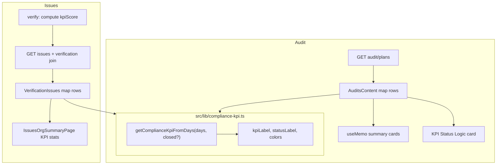

# Audit & Issue KPI System (Document Parity)

## Document KPI system (current state)

The document module does **not** use one unified KPI library. Behavior is split across [`DocumentsContent.tsx`](src/components/documents/DocumentsContent.tsx):

| View                     | KPI column source                                                           | Status column                                    | Thresholds                                                                     |
| ------------------------ | --------------------------------------------------------------------------- | ------------------------------------------------ | ------------------------------------------------------------------------------ |
| **Master Document List** | Stored `wizard.riskLevel` (`high` / `medium` / `low`) — mislabeled as “KPI” | `docStatus` from workflow + annual review        | N/A for KPI                                                                    |
| **Documentary Evidence** | **Computed client-side** from `created_at`                                  | `Success` / `Pending` / `Fail` (same thresholds) | ≤30d → Consistent / green; 31–40d → Pending / amber; >40d → Inconsistent / red |

Shared UX patterns on the evidence/disposal views:

- Colored KPI text in table (`text-[#22B323]`, amber, red)
- Column hint: `≤30d Green · >30d Yellow · >40d Red`
- **KPI Status Logic** legend card (lines 2182–2205)
- KPI included in Excel export
- **No DB column** — derived at render time

```mermaid
flowchart LR
  subgraph docs [Documents]
    Capture["capture created_at"]
    Calc["days since reference date"]
    Labels["Consistent | Pending | Inconsistent"]
    Status["Success | Pending | Fail"]
    Capture --> Calc --> Labels
    Calc --> Status
  end
```



**Recommendation for audit/issues:** implement the **time-based compliance KPI** (evidence pattern), not the master-list risk-level pattern. Audit already has equivalent day logic in [`getAuditStatusByDays`](src/components/audit/AuditsContent.tsx) (lines 96–128); issues have the data hooks (`deadline`, `issue_verifications.kpiScore`) but no wiring.

---

## Gap analysis

### Audit ([`AuditsContent.tsx`](src/components/audit/AuditsContent.tsx))

| Has                                       | Missing vs documents                                                                    |
| ----------------------------------------- | --------------------------------------------------------------------------------------- |
| `getAuditStatusByDays` (30/40 thresholds) | KPI column shows **program KPI score** from `audit_program_kpis`, not time-based labels |
| KPI + Audit Status columns                | No **KPI Status Logic** legend                                                          |
| Plans loaded via React Query              | **Hardcoded** summary cards (Total `6`, Success `50%`, etc. — lines 662–692)            |
| API returns `kpiScore` from program       | No client derivation of `Consistent`/`Pending`/`Inconsistent`                           |

### Issues ([`VerificationIssues.tsx`](src/components/manageissue/VerificationIssues.tsx))

| Has                                      | Missing vs documents                                                                                                                      |
| ---------------------------------------- | ----------------------------------------------------------------------------------------------------------------------------------------- |
| KPI column + “Avg. KPI Score” card in UI | KPI always `0`; avg score **hardcoded `2.3`**                                                                                             |
| `kpiScore` saved on verify               | Always sends `kpiScore: 3` (line 363); never calculated                                                                                   |
| `deadline` in DB + process issues API    | Org issues API ([`issues/route.ts`](src/app/api/organization/[orgId]/issues/route.ts)) **does not return** `deadline` or verification KPI |
| Summary tab with live counts             | No compliance KPI labels, legend, or overdue KPI stats                                                                                    |

---

## Target architecture



---

## Implementation plan

### 1. Extract shared compliance KPI utility

**New file:** [`src/lib/compliance-kpi.ts`](src/lib/compliance-kpi.ts)

Centralize logic currently duplicated in:

- [`DocumentsContent.tsx`](src/components/documents/DocumentsContent.tsx) (~1430–1432, 1940–1943)
- [`AuditsContent.tsx`](src/components/audit/AuditsContent.tsx) (`getAuditStatusByDays`)

Exports (suggested):

- `COMPLIANCE_KPI_THRESHOLDS = { pendingDays: 30, failDays: 40 }`
- `getDaysSince(referenceDate: Date | string | null): number`
- `getComplianceKpiFromDays(days: number, options?: { closed?: boolean })` → `{ kpiLabel: 'Consistent' | 'Pending' | 'Inconsistent', statusLabel: 'Success' | 'Pending' | 'Fail' | 'In-Progress', kpiColorClass, statusBadgeClass }`
- `getComplianceKpiFromReferenceDate(refDate, options)` — wrapper
- Optional: `kpiScoreToLabel(score: number)` and `kpiLabelToScore(label)` for issues DB (`kpiScore` INTEGER): e.g. Consistent=3, Pending=2, Inconsistent=1

Refactor `DocumentsContent` to call the shared util (small, safe change — removes duplicate export/table formulas).

Add reusable UI helper: `KpiStatusLogicCard` in [`src/components/compliance/KpiStatusLogicCard.tsx`](src/components/compliance/KpiStatusLogicCard.tsx) (extract from documents legend).

---

### 2. Audit module

**File:** [`src/components/audit/AuditsContent.tsx`](src/components/audit/AuditsContent.tsx)

1. **KPI column** — derive time-based label from reference date (`plannedDate || datePrepared || createdAt`), same as `getAuditStatusByDays` input:
   - If `planStatus === 'closed'` → `Consistent` / `Success`
   - Else use day thresholds → `Consistent` | `Pending` | `Inconsistent`
   - Keep program `kpiScore` as optional secondary display (tooltip or sub-line) **only if** it is a non-empty custom value; primary column matches documents

2. **Audit Status column** — optionally simplify badges to document-style `Success` / `Pending` / `Fail` (map from existing long labels) OR keep long labels but color-map via shared util

3. **Summary cards** — replace hardcoded values with `useMemo` over `audits`:
   - Total audits = `audits.length`
   - Success rate = % closed OR `statusLabel === 'Success'`
   - Backlogs = open audits where `kpiLabel === 'Pending' || 'Inconsistent'`
   - Avg closure time = mean days from `createdAt` to close (when `planStatus === 'closed'`)

4. **KPI Status Logic card** — render `KpiStatusLogicCard` below the audit table (always visible, not gated on a sub-table like documents)

5. **Column hint** on KPI header: `≤30d Green · >30d Yellow · >40d Red`

No API/schema change required for audit (client-side derivation matches documents).

**Follow-up (optional, out of initial scope):** wire [`processes/[processId]/audits/page.tsx`](src/app/dashboard/[orgId]/processes/[processId]/audits/page.tsx) to real `AuditsContent` with `processId` filter — currently mock data.

---

### 3. Issue module — API layer

**Files:**

- [`src/app/api/organization/[orgId]/issues/route.ts`](src/app/api/organization/[orgId]/issues/route.ts)
- [`src/app/api/organization/[orgId]/processes/[processId]/issues/route.ts`](src/app/api/organization/[orgId]/processes/[processId]/issues/route.ts)

Extend SELECT with lateral join (table may not exist on old tenants — guard like audit KPI join):

```sql
LEFT JOIN LATERAL (
  SELECT "kpiScore", "closeOutDate", "verificationDate", "verificationStatus"
  FROM issue_verifications v
  WHERE v."issueId" = i.id
  LIMIT 1
) iv ON true
```

Return on each issue: `deadline`, `kpiScore`, `closeOutDate`, `verificationDate` (org route currently omits `deadline` at line 157).

---

### 4. Issue module — UI layer

**File:** [`src/components/manageissue/VerificationIssues.tsx`](src/components/manageissue/VerificationIssues.tsx)

1. Extend `Issue` interface with `deadline`, `kpiScore`, `closeOutDate`, `createdAt`

2. **Row mapping** after fetch — for each issue compute via `compliance-kpi`:
   - **Open issues:** days since `createdAt` toward `deadline` (or since `createdAt` if no deadline)
   - **Closed (`done`):** days from `createdAt` to `closeOutDate` or `verificationDate`; prefer stored `kpiScore` if present, else compute

3. **KPI column** — show colored `Consistent` / `Pending` / `Inconsistent` (not raw `0`)

4. **Add Compliance Status column** (optional but matches documents): `Success` / `Pending` / `Fail` badges

5. **Populate Plan / Due columns** from `createdAt` and `deadline` (replace `—` placeholders at lines 816–818)

6. **Avg. KPI Score card** — compute mean of `kpiScore` (or mapped label scores) from loaded issues; remove hardcoded `2.3`

7. **On verify submit** (`handleSubmitEffective`) — replace `kpiScore: 3` with calculated score from `closeOutDate` vs `deadline` (or vs `createdAt`)

8. **KPI Status Logic card** below the All Issues table

**File:** [`src/components/issues-workspace/IssuesOrgSummaryPage.tsx`](src/components/issues-workspace/IssuesOrgSummaryPage.tsx)

Add 2–3 summary metrics using the same util over `getOrgIssues` payload:

- % Consistent (on-time / closed within threshold)
- Overdue / Inconsistent count
- Optional: avg KPI score

---

### 5. Types and API client

- Update issue types in [`src/lib/api-client.ts`](src/lib/api-client.ts) (or wherever `getOrgIssues` response is typed) to include new fields
- No migration needed — `issue_verifications.kpiScore` already exists ([`007_add_issue_verifications.sql`](prisma/tenant-migrations/007_add_issue_verifications.sql))

---

## Files to touch (summary)

| File                                                       | Change                                   |
| ---------------------------------------------------------- | ---------------------------------------- |
| `src/lib/compliance-kpi.ts`                                | **New** — shared thresholds + helpers    |
| `src/components/compliance/KpiStatusLogicCard.tsx`         | **New** — legend UI                      |
| `src/components/documents/DocumentsContent.tsx`            | Refactor to use shared util              |
| `src/components/audit/AuditsContent.tsx`                   | Live stats, derived KPI column, legend   |
| `src/app/api/organization/[orgId]/issues/route.ts`         | Join verification + return deadline      |
| `src/app/api/.../processes/[processId]/issues/route.ts`    | Same verification join                   |
| `src/components/manageissue/VerificationIssues.tsx`        | Wire KPI display, calc on verify, legend |
| `src/components/issues-workspace/IssuesOrgSummaryPage.tsx` | KPI summary metrics                      |

---

## Testing checklist

- **Documents:** evidence KPI labels unchanged after refactor
- **Audit:** open plan at 25d → Consistent; 35d → Pending; 45d → Inconsistent; closed → Consistent; summary cards match table counts
- **Issues:** open issue approaching deadline shows correct color; verify effective computes non-default `kpiScore`; KPI column and avg card update after verify; org + process routes both return KPI fields
- **Edge cases:** missing `deadline`, missing `issue_verifications` table, missing dates → safe defaults (`Consistent` or `—`)

---

## Out of scope (can follow later)

- Settings mock page [`settings/kpi-reports`](src/app/dashboard/[orgId]/settings/kpi-reports/page.tsx) — not wired to real module data
- Process-scoped audit mock page
- Excel/PDF export for audit/issue tables (documents has export; not required for parity unless requested)
- Master-document-style **risk level** KPI for audits/issues
